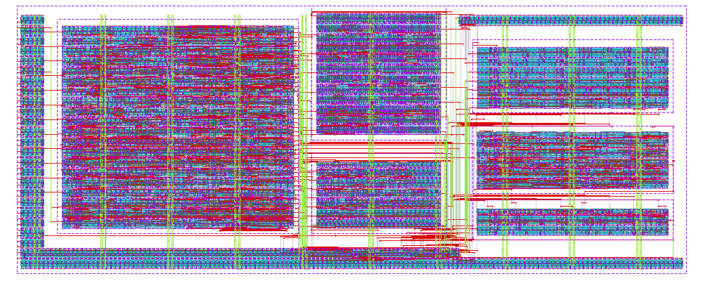

# Noiser top level: `heichips26_noise_gen` (ihp-sg13cmos5l)

<p align="center">
  <a href="final/render/heichips26_noise_gen.png">
    
  </a>
  <br>
  <em>Render of the heichips26_noise_gen layout (small slot, 500 × 200 µm).</em>
</p>

This directory holds the top level of Noiser, our HeiChips 2026 design. The top cell `heichips26_noise_gen` implements the standard chip interface (`ui_in`, `uo_out`, `uio_*`, `ena`, `clk`, `rst_n`). It contains `noise_gen_top`, which wires six separately hardened macros together with a few standard cells for the source selection.

The design reasoning, pin assignment, register map, simulation results and known limitations are in [documentation/reasoning.md](../../documentation/reasoning.md). This README only covers the files and the build.

## Directory Structure

```text
heichips26_digital_project/
├─ rtl/
│  ├─ heichips26_noise_gen.sv   # top cell: chip interface → noise_gen_top
│  └─ noise_gen_top.sv          # macro instances + source muxes for the loads
├─ macros/                      # one hardened macro per block, each with the same layout (see below)
│  ├─ ctrl/                     # control registers + xorshift32 PRNG (only block on clk)
│  ├─ a_ro/                     # ring oscillator, 3 … 1011 inverters, 8 intermediate outputs
│  ├─ d_ro_tapped/              # ring oscillator, 15 … 139 inverters, ÷1 … ÷8 divider (main RO)
│  ├─ e_load_uniform/           # 8 inverter-tree loads, one osc input and enable each
│  ├─ f_load_binary/            # 5 × 12-bit LFSR load, clock-gated per enable bit
│  ├─ g_glitch/                 # delay line + XOR glitch generator driving 8 waster branches
│  └─ b_ro/, c_ro/              # fixed ROs, removed from the chip (not built or placed)
├─ flow/librelane/              # top-level LibreLane config, SDC files, HeiChips DEF templates
├─ final/                       # GDS, LEF, LIB, NL, PNL, SPEF, VH, render (used by submission.yaml)
├─ netlist/                     # nl, pnl and spice netlists of the last run
├─ verification/                # DRC, LVS, antenna, STA, power and IR-drop reports of the last run
├─ testbenches/                 # still the template's counter tests (see Simulation)
├─ fpga/                        # template FPGA flow, not adapted (see FPGA)
├─ run.sh                       # builds all macros, then the top level
├─ clean.sh                     # cleans all macros, then the top level
└─ Makefile
```

Every macro directory has the same structure: `rtl/`, `flow/librelane/` (config, `pin_order.cfg`, SDC), `final/`, `netlist/` (including `netlist/pex/`, the Magic PEX netlist), `verification/`, `schematic/xschem/` (symbols for the testbenches) and `testbenches/`.

## Macros

The macros are integrated as black boxes through the `MACROS` section of [flow/librelane/config.yaml](flow/librelane/config.yaml), which uses the GDS, LEF, VH, LIB and SPEF views from each `macros/<macro>/final/`. The same section sets the placement of each macro. The die size of each macro is `DIE_AREA` in its own `flow/librelane/config.yaml`.

| Macro | Die (µm) | Location (µm) |
|---|---|---|
| ctrl | 180 × 160 | (30, 30) |
| d_ro_tapped | 100 × 60 | (220, 30) |
| a_ro | 100 × 100 | (220, 90) |
| g_glitch | 150 × 30 | (340, 25) |
| f_load_binary | 150 × 50 | (340, 60) |
| e_load_uniform | 150 × 55 | (340, 120) |

**Build order matters.** The top level uses the `final/` views of the macros, so a changed macro has to be rebuilt (`make build-top` in its directory) before the top level.

## Build

From the repository root, inside `nix-shell`, with `PDK_ROOT` and `PDK` exported (see the [root README](../../README.md#build)):

```sh
cd macros/heichips26_digital_project
./run.sh                  # all macros, then the top level
```

`make chip` in the repository root does the same, and the CI uses it. With the Makefile in this directory:

```sh
make build-macros build-top   # same as run.sh
make all                      # lint, build all macros and the top level, then the block-level simulations
make build-ctrl build-top     # rebuild one macro (here ctrl), then the top level
make build-top                # rebuild only the top level (after a change to rtl/ or to the top-level config)
```

`./clean.sh` (or `make clean-all`) deletes the build outputs of all macros and the top level.

### Makefile Targets

`make` (or `make help`) lists all targets:

| Target | Function |
|---|---|
| `all` | `lint-verilog-all`, `build-macros`, `build-top`, then `sim-all` |
| `build-<macro>` | `build-top` of one macro (`a_ro`, `d_ro_tapped`, `ctrl`, `e_load_uniform`, `f_load_binary`, `g_glitch`) |
| `build-macros` | All six macros, in the order of `run.sh` |
| `build-top` | `librelane`, then `copy-reports`, `copy-final` and `copy-netlist` |
| `librelane` | LibreLane run with Magic and KLayout DRC. Variants: `librelane-nodrc`, `librelane-magicdrc`, `librelane-klayoutdrc` |
| `librelane-openroad`, `librelane-klayout` | Open the last run in the OpenROAD GUI or in KLayout |
| `copy-reports` | Copy the reports of the last run to `verification/` |
| `copy-final` | Copy GDS, LEF, LIB, NL, PNL, SPEF, VH and render of the last run to `final/` |
| `copy-netlist` | Copy the spice, pnl and nl netlists of the last run to `netlist/` |
| `lint-verilog` | Verilator lint of the whole design (top level and all macro RTL, standard cells from the PDK models). `CELL=<module>` lints a single module of it |
| `lint-verilog-all` | `lint-verilog-all` of every macro, then `lint-verilog` |
| `sim-all` | The block-level simulations: ctrl cocotb (RTL and gate level), f_load_binary Verilog testbench. Not the transistor-level xschem testbenches (see [Simulation](#simulation)) |
| `sim-rtl-verilog`, `sim-rtl-cocotb`, `sim-gl-cocotb` | Simulate `CELL` (default `heichips26_noise_gen`) with its testbench in `testbenches/`. There is no top-level testbench yet |
| `clean` | Delete the generated files of the top level (`flow/librelane/runs/`, `flow/final/`, `final/`, `netlist/`, `verification/`, simulation and FPGA outputs) |
| `clean-<macro>`, `clean-macros`, `clean-all` | Delete the generated files of one macro, of all macros (including b_ro and c_ro, like `clean.sh`), or of all macros and the top level |

The macro Makefiles have the same LibreLane and copy targets. Except for ctrl, their `build-top` also runs `generate-xspice` and `magic-pex`, which write the XSPICE model and the PEX netlist that the xschem testbenches use.

### Signoff

The LibreLane flow runs Magic and KLayout DRC, Netgen LVS and the OpenROAD antenna check; the reports end up in `verification/`. The HeiChips precheck runs from the repository root with `make precheck`. The current signoff status is in [reasoning.md](../../documentation/reasoning.md#implementation).

## Simulation

The block-level tests are in the macro directories. The [root README](../../README.md#testing) lists how to run them, and [reasoning.md](../../documentation/reasoning.md#verification) lists the results.

`make sim-all` runs the block-level testbenches that need no manual setup. A failing f_load_binary check stops it (`$fatal`), but a failing ctrl cocotb test doesn't: outside pytest, cocotb's runner returns normally, so check the `TESTS=5 PASS=5 FAIL=0` lines in the output.

> [!WARNING]
> There is no top-level simulation yet. `testbenches/cocotb/heichips26_digital_project_tb.py` and `testbenches/verilog/heichips26_digital_project_tb.sv` are the template's counter tests and are not used.
>
> A top-level Verilog testbench goes into `testbenches/verilog/heichips26_noise_gen_tb.sv` and runs with `make sim-rtl-verilog`. The target compiles the testbench first (its `timescale` then also covers the RTL), all RTL with `-DSIM` (the RO models replace the rings) and the standard-cell models with `-gno-specify`.
>
> The testbench must keep `d_ro_tapped`'s `invsel`/`ffsel` defined until ctrl has been reset: ctrl resets synchronously, `config` is X until the first clock edge, and the d_ro_tapped model then waits an X delay, which iverilog runs as a zero-delay loop (the simulation hangs at t = 0).

## FPGA

The `fpga/` directory is the template's FPGA emulation flow (ULX3S and other boards, see [fpga/README.md](fpga/README.md)). It has not been adapted: `fpga/dut.mk` still lists the counter RTL, and the ring oscillators and hand-instantiated standard cells of the macros can't be mapped to an FPGA as they are. The FPGA targets (`build-fpga`, `load-fpga`, `flash-fpga`) were therefore removed from this Makefile; `make clean` still cleans `fpga/`.
